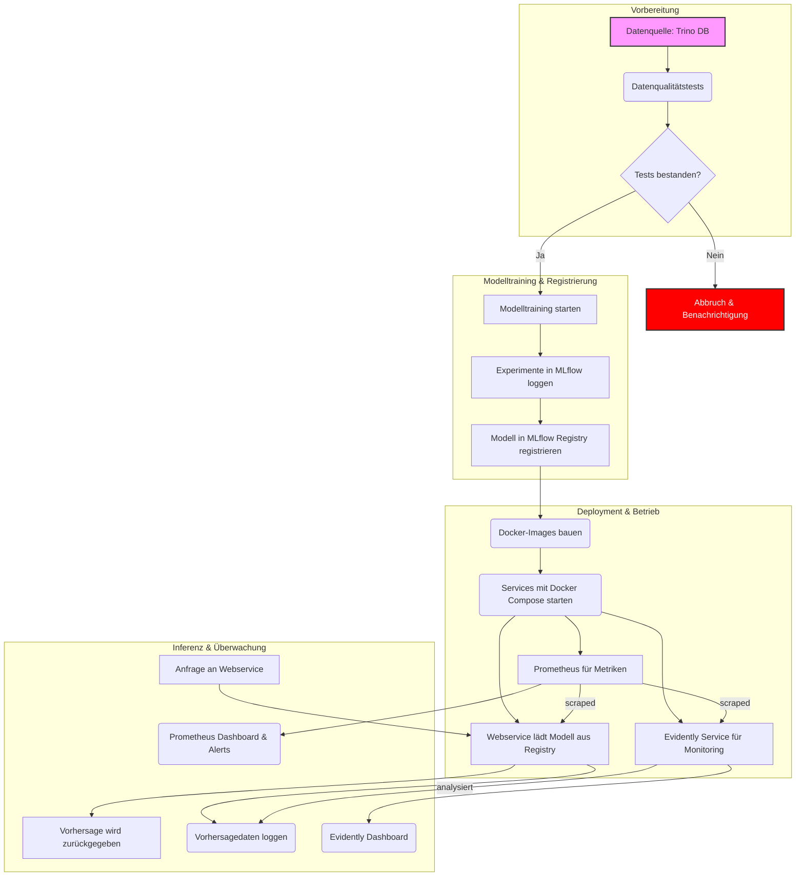

```mermaid
graph TD
    subgraph "Vorbereitung"
        A[Datenquelle: Trino DB] --> B(Datenqualitätstests);
        B --> C{Tests bestanden?};
    end

    subgraph "Modelltraining & Registrierung"
        C -- Ja --> D[Modelltraining starten];
        D --> E[Experimente in MLflow loggen];
        E --> F[Modell in MLflow Registry registrieren];
    end

    C -- Nein --> G[Abbruch & Benachrichtigung];

    subgraph "Deployment & Betrieb"
        F --> H(Docker-Images bauen);
        H --> I(Services mit Docker Compose starten);
        I --> J[Webservice lädt Modell aus Registry];
        I --> K[Evidently Service für Monitoring];
        I --> L[Prometheus für Metriken];
    end

    subgraph "Inferenz & Überwachung"
        M[Anfrage an Webservice] --> J;
        J --> N[Vorhersage wird zurückgegeben];
        J --> O(Vorhersagedaten loggen);
        K -- analysiert --> O;
        K --> P(Evidently Dashboard);
        L -- scraped --> J;
        L -- scraped --> K;
        L --> Q(Prometheus Dashboard & Alerts);
    end

    style A fill:#f9f,stroke:#333,stroke-width:2px
    style G fill:#f00,stroke:#333,stroke-width:2px,color:#fff
```
