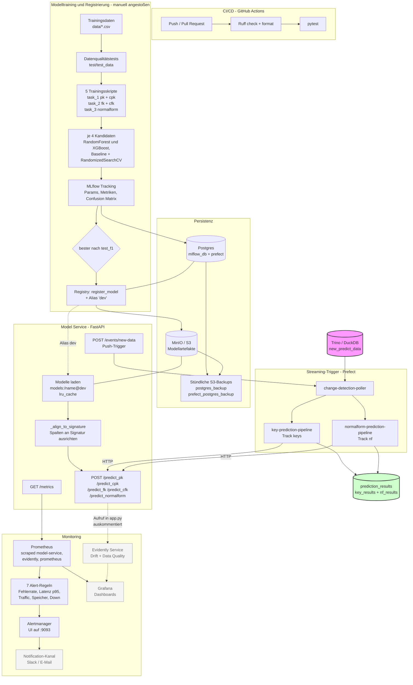
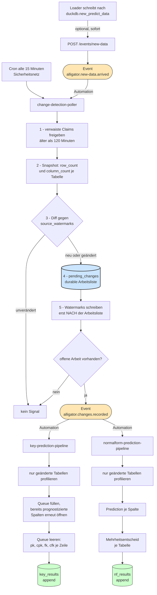
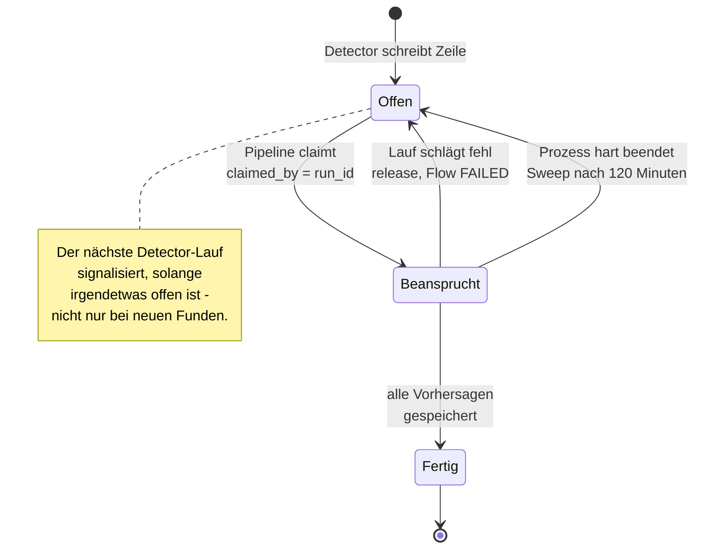

# Flowchart

**Stand: 27. Juli 2026** — abgeglichen mit dem tatsächlichen Repo- und Container-Zustand.

Gestrichelte, graue Knoten existieren als Container oder Datei, sind aber **noch nicht
funktional angeschlossen**. Sie stehen bewusst im Diagramm, damit die Lücke sichtbar
bleibt statt zu suggerieren, das Monitoring sei fertig.

---

## 1. Gesamtsystem

**Noch nicht angeschlossen:**

- **Grafana** läuft, aber `grafana/provisioning/` und `grafana/dashboards/` sind leer.
- **Evidently** läuft noch auf den `green_taxi_data`-Tutorialdaten; der Monitoring-Aufruf
  in [app.py](../webservice/app.py) ist auskommentiert.
- **Alertmanager** empfängt Alerts, hat aber einen Null-Receiver — es geht nichts raus.

---

## 2. Streaming-Trigger im Detail

Zwei Wege lösen denselben Detector aus. Der Push ist schnell, der Cron fängt alles ab,
was der Push verpasst. Details und Begründungen in [STREAMING_PIPELINE.md](STREAMING_PIPELINE.md).

Beide Pipelines hängen am **selben** Event und laufen parallel — keine kann die andere
aushungern. Die Ergebnisse werden angehängt, nicht überschrieben: eine neu geladene
Tabelle behält ihre alten Vorhersagen als Historie.

---

## 3. Lebenszyklus einer erkannten Änderung

Der subtilste Teil und der, an dem beim ersten Ende-zu-Ende-Test tatsächlich etwas
schiefging: eine Pipeline darf ihre Änderung erst abschließen, wenn die Vorhersagen
wirklich vorliegen. Sonst gilt die Arbeit als erledigt, obwohl nichts entstanden ist,
und der Retry-Pfad sieht sie nie wieder.

Jede Zeile durchläuft diesen Zyklus **pro Track getrennt** — `keys` und `nf` haben
eigene Claim- und Completion-Spalten.

Der Detector sendet sein Signal auf Basis der **offenen Arbeit**, nicht auf Basis
dessen, was er gerade gefunden hat. Andernfalls wäre freigegebene Arbeit für immer
liegengeblieben: die Watermarks sind zu diesem Zeitpunkt schon geschrieben, kein
späterer Lauf würde die Tabelle noch einmal als geändert erkennen.

---

## 4. Was der Chart nicht abbildet

- **Batch-Betrieb ohne Streaming.** Beide Pipelines laufen weiterhin per
  `python prefect/<pipeline>.py` als vollständiger Schema-Scan. Streaming ist per
  `use_pending_changes=True` opt-in und wird nur von den Deployments gesetzt.
- **Retraining.** Nicht implementiert; die Trainingsskripte werden von Hand gestartet.
- **Docker-Build in CI.** Images werden lokal gebaut, es gibt keinen GHCR-Push.
